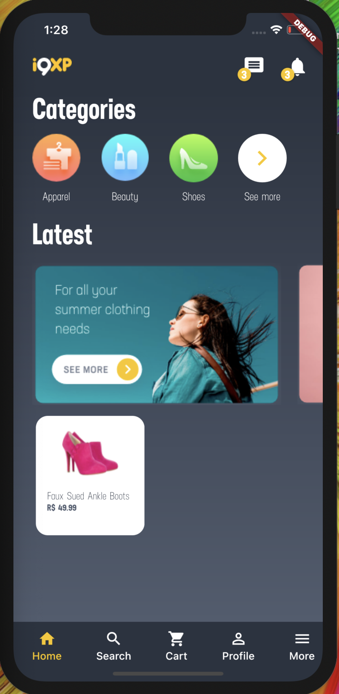
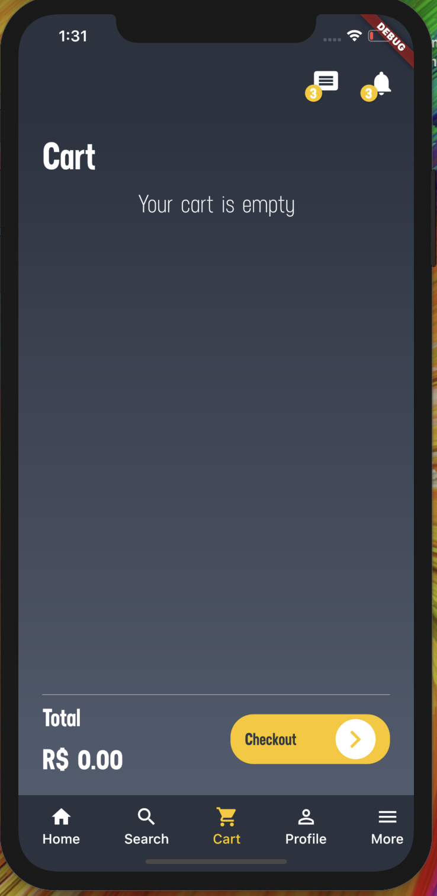
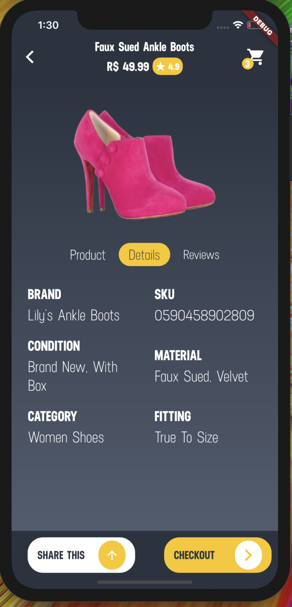
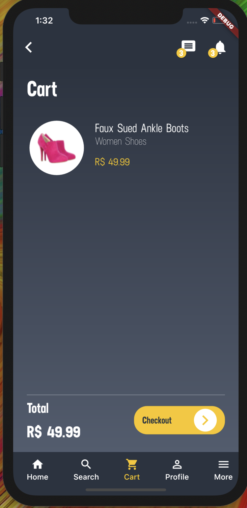
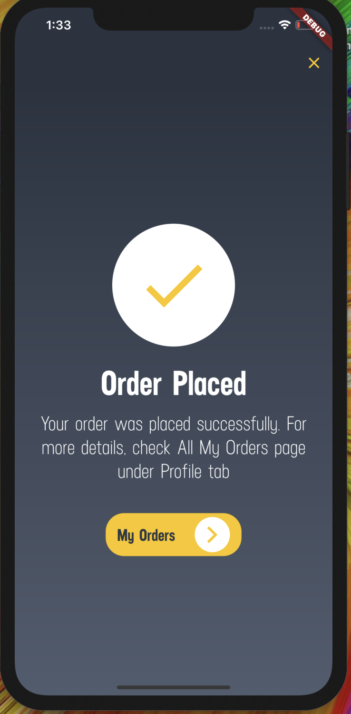

# Teste Mobile

## About the project

 This is a Flutter project that was made for i9xp selection process.

## Technologies
 
 - Firebase(Cloud firestore and storage) - To get informations about categories, products and banners.
 - Mobx - State Manegement
 - Hive - Local Storage(shopping-cart)
 - Slidy - Package manager

## Design

 # Home

 
 
 # Empty Cart
 
 
 
 # Product page
 
 
 
 # Cart with product
 
 
 
 # Order placed
 
 
 
 
 

